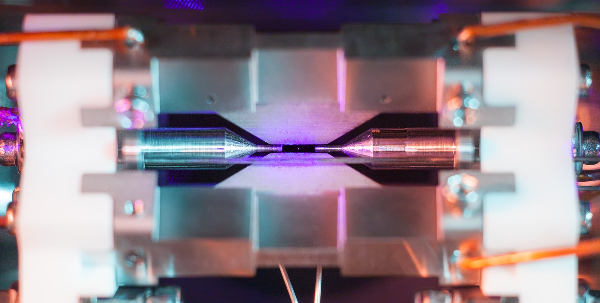

# Ion trap designs and realizations

## Background
Quadrupole ion traps (Paul traps) use RF and DC electric fields to confine charged particles. Ion traps come in several electrode designs, depending on their main application. A typical 'macroscopic' ion trap, shown below, consists of a set of electrodes arranged in three spatial dimensions:
* 4 rods or blades in an elongated mount (two connected to RF, and two connected to ground), providing radial confinement,
* and two end-caps (both connected to high DC voltage), providing axial confinement.

 
Figure: Photograph of a macroscopic blade trap with a single trapped strontium ion at the University of Oxford. Image credit: David Nadlinger.

These traps allow for the storage of both individual ions and clouds of ions, and are still employed for state-of-the-art quantum optics experiments. However, as people want to trap and control a growing number of ions, a further segmentation of electrodes becomes necessary. Segmented traps can either have a three-dimensional arrangement of their electrodes (3D traps), or their electrodes can be patterned on the surface of a microchip (surface traps).

## Overview of trap designs

### 3D ion traps

### Surface ion traps
- [Innsbruck 'Golden Gate' surface trap](ibk_'Golden-Gate'_surface-trap/ibk_'Golden-Gate'_surface-trap.md)

## Definitions and Nomenclature
See the [ion-trap-related definitions](definitions_ion-traps.md).

## Simulation suite
The [simulation suite](ion_trap_simulation_suite.md) allows for the  automated simulation of trapping potentials of a given trap design and gives details on best-practices regarding the recommended evaluation of these potentials to predict the performance of ion traps. Furthermore, the suite allows for the simulation of electric and magnetic fields emanating from a trap (including the full mount, vacuum chamber, etc), which are requires for certification of traps, e.g. to ensure compliance with health-care or electromagnetic environment standards. Note that compliance simulations need to be additionally cross-checked with experimentally obtained data, before any kind of certification can proceed.  
