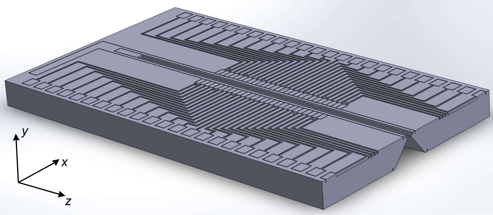
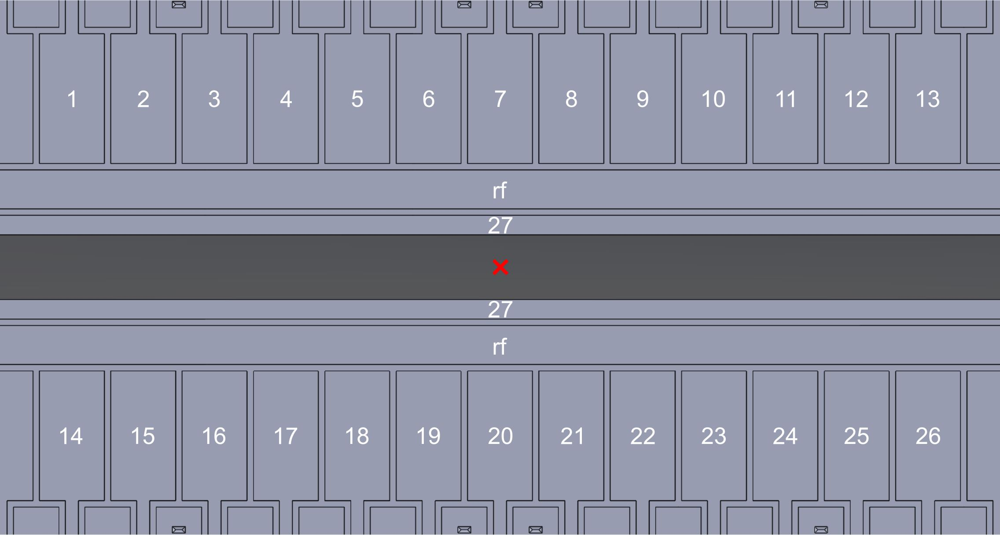
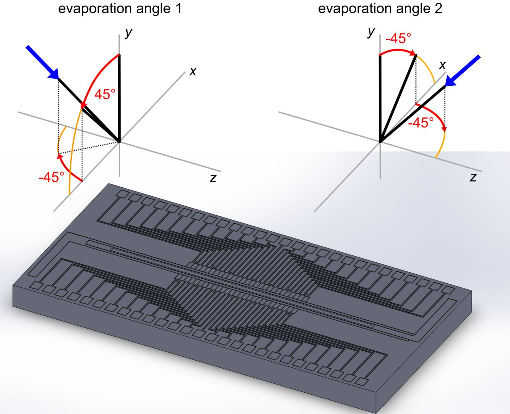

# Trap Name
Innsbruck 'Golden Gate' surface ion trap

## Contributors
### Original work
Martin van Mourik, Philipp Schindler, Thomas Monz, Rainer Blatt
### Article contributors
- Author: Philip Holz
- Reviewer: Thomas Monz, Philipp Schindler, Martin van Mourik

## Application
The Innsbruck 'Golden Gate' surface ion trap is a segmented chip trap designed for ion-shuttling-assisted quantum computing. The trap features 55 individual DC segments and a through-chip slot for optical addressing of ion qubits and backside loading. A predecessor of the trap has been used to demonstrate coherent rotations of qubits [[1]](#references).

## Background
The trap was designed by Martin van Mourik in 2018, built by Translume [3] (see [Suppliers](#suppliers)), and has been successfully commissioned in the same year at the EQUAL experiment at the [ion trapping group of Rainer Blatt](https://quantumoptics.at/en/), Innsbruck University. The electrode design is based on proven designs from the [ion trapping group of Hartmut Häffner](https://ions.berkeley.edu/), University of Berkeley, described in Refs. [[1,2]](#references).

## Legal status
- Source of information:
  - Publication, see [References](#references) below
  - Personal communication with Martin van Mourik (2021)
- Copyright/Intellectual property: Public domain

## Specifications
Cf. [ion-trap-related definitions](../definitions_ion-traps.md) for a description of the listed parameters.

### Employed materials

| Material | Component | Comment |
|----|----|----|
| Fused silica | substrate |  |
| Titanium | adhesion promoter for metallization | evaporated |
| Gold | metallization | evaporated|

### Geometrical/footprint

|    | targeted | achieved |
|----|----|----|
| Overall dimensions | 9 mm $$\times$$ 4.5 mm $\times$ 0.5 mm | id. |
| Feature size (min / max) | 10 µm / 8.6 mm | id. |
| Manufacturing precision | (1-2) µm | id. |
| Electrode surface roughness | n.a. | n.a. |
| Electrode metallization thickness | ~ 226 nm | id. |

### Interface

| Category | Component | # channels | Comment |
|----|----|----|----|
| electrical | RF | 1 | voltage range: 400 V |
| electrical | DC low current | 55 | voltage range: +/- 40 V |

### Optical

|    | targeted | achieved |
|------|------|------|
| Optical access NA (through slot)| 0.27 | id. |
| Optical access NA (along surface)| 0.05 | id. |

### Electrical

|    | targeted | achieved |
|----|----------|----------|
| Capacitance RF to GND | 2.0 pF$^{\dagger}$ | n.a. |
| Quality factor (@ RF drive frequency ) | n.a. | n.a. |
| Capacitance RF to central DC | 0.14 pF$^{\dagger}$ | n.a. |
| Capacitance central DC to GND | 1.4 pF$^{\dagger}$ | n.a. |
| Capacitance RF to DC segment | 0.0011 pF$^{\dagger}$ | n.a. |
| Capacitance DC segment to GND | 0.19 pF$^{\dagger}$ | n.a. |
| Leakage current | n.a. | n.a. |
| Electric strength (breakdown voltage) DC | > 40 V | id. |
| Electric strength (breakdown voltage) RF | > 400 V | id. |

$^{\dagger}$ target capacitance values are derived from finite element simulations of the trap structure.

### Thermal environment

|    | targeted | achieved |
|----|----------|----------|
| Trap operation temperature | ~ 10 K | id. |
| Maximum bake-out temperature | 373 K (100 °C) | id. |
| Maximum temperature ramp | ~ 4 K/h | id. |

### Trapology

|    | targeted | achieved |
|----|----------|----------|
| Ion-electrode separation | 121 µm | id. |
| Trapping height above surface| 110 µm | id. |
| RF drive: voltage @ frequency ($q = 0.3$) | ~ 250 V @ 40 MHz | id.  |
| DC confinement: maximum voltage (1 MHz axial frequency) | ~ 14 V | id. |
| Anharmonicity RF / DC potential (max over 3 spatial directions) | n.a. | n.a. |
| Minimum characteristic distance (min over all electrodes and spatial directions)| 4.6 mm (segments), 0.92 mm (central DC)  | id. |
| Typical stray electric fields (3 spatial directions)  | n.a. | ~ 100 V/m $^{\dagger}$ |
| Residual micromotion modulation index  (3 spatial directions)  | n.a. | < 0.01 radial, ~ 0.2 axial $^{\dagger\dagger}$ |
| Heating rate @ secular frequency (3 spatial directions)  | n.a. | ~ 20 phonons/s @ 1 MHz axial   n.a. in radial directions |

$^{\dagger}$ after running the oven for a long time, stray electric fields can temporarily reach more than 1000 V/m.

$^{\dagger\dagger}$ the residual axial micromotion modulation index is likely limited by an RF-carrying wire off to the side of the trap.

## Technical approach
The Innsbruck 'Golden Gate' trap, depicted in the figure below, consists of 27 pairs of individually addressable electrodes, a central electrode, and central rf rails. The electrode pairs have a length of 100 μm along z. The central electrode has a width of 30 µm (along x), and the rf rails have a width of 60 µm. The slot width is 100 µm. All electrodes are separated by 10 μm wide and 50 µm deep trenches. The electrode layout yields an ion trapping position 110 μm above the trap plane, and a 121 μm ion-electrode separation. Ion crystals are oriented along the z-axis, and the rf rails produce a confining pseudopotential in the xy-plane.

 
Figure: Overview of the electrode layout of the Innsbruck 'Golden Gate' trap. The cross section view at the right end of the chip shows the tapered through-chip slot. Between the segment leads are markers used for identification of the trap region relative to the imaging field of view. The total chip dimensions are $9\times4.5\times0.5\,\text{mm}^3$.

## Technical drawings
- A [technical drawing](supplemental_material/ibk_Golden-Gate-trap_layout.PDF) with overall dimensions of the trap chip is available in pdf format.
- The full [3D model](supplemental_material/ibk_Golden-Gate-trap_layout.STEP) of  the trap is available in STEP format.

## Trap simulation output
- [Spherical harmonics expansion coefficients](supplemental_material/multipole_coeffs.txt) for the DC electrodes 1-27 as labelled in the figure below. The expansion coefficients are evaluated at the trap centre, marked with a red cross in the figure below, and assuming 1 volt is applied to the respective electrode. The coefficients are consistent with the spherical harmonics expansion in the [ion-trap-related definitions](../definitions_ion-traps.md). Note that the 1st order coefficients $C_{1,j}$ have unit 1/mm while the 2nd order coefficients $C_{2,j}$ have unit  1/mm². 
- [List of voltages](supplemental_material/multipole_voltages.txt) required to generate a specific spherical harmonic potential. The voltages are sorted consistently with the electrode labelling in the figure below.

 
Figure: Assignment of DC electrodes 1-27 used in the provided trap simulation output files. The simulation is for an ion position at the trap centre (marked with a red cross), and 110 µm above the surface.

## Suppliers
The fused silica trap substrate was patterned by Translume [3] using a combination of pulsed-laser glass weakening and hydrofluoric acid etching.

## Assembly
The patterned substrate was gold-coated in the cleanroom facilities in Innsbruck with an e-beam evaporator.
Prior to coating the trap was rinsed with deionized water and blow-dried with nitrogen. For the coating, about 10 nm Ti (as adhesion promoter) and 150 nm gold was applied under two different evaporation directions per chip side, as illustrated in the figure below: Evaporation angle 1 is found by rotating the surface normal by 45° around the z-axis, followed by a -45° rotation around the y-axis. Evaporation angle 2 is found by a -45° rotation around the z-axis, followed by a -45° rotation around the y-axis. Both the top and bottom side of the trap were coated from these two directions. The resulting metallic coating is thus a sequence of Ti-Au-Ti-Au, with a total thickness of about 226 nm. The evaporation chamber had to be vented in between the individual coating steps to change the coating direction, i.e. in total 4 evaporation runs were needed.

 
Figure: Illustration of the two evaporation angles used to coat both front and back side of the trap chip substrate.

The coated trap was glued onto an interposer PCB and its electrodes were wire bonded to electrical supply leads, for details see the [Innsbruck Golden Gate trap mount](../../mounts/ibk-GoldenGate_TrapMount/GoldenGate_trap_mount.md). Subsequently, the trap was inserted in the vacuum chamber without additional cleaning steps.  

## Measurement protocol (optional)
n.a.

## Experience and further comments
The general behaviour of the trap is good, with basically infinite Doppler-cooled lifetimes for single species ion crystals ($^{40}\mathrm{Ca}^{+}$ or $^{88}\mathrm{Sr}^{+}$). Storage and control of ion motion of mixed species crystals requires careful control of voltage ramps and stray field compensation; a deeper trapping potential might be useful there. A similar experience in trap operability (stray charges, heating rate, etc.) has been made in the past with predecessors of the trap, having slightly different electrode geometry but identical fabrication method.

## References
[1] M. van Mourik et al., *Coherent rotations of qubits within a surface ion-trap quantum computer*, Phys. Rev. A **102**, 022611 (2020), https://doi.org/10.1103/PhysRevA.102.022611, https://arxiv.org/pdf/2001.02440.pdf

[2] N. Daniilidis et al., *Surface noise analysis using a single-ion sensor*, Phys. Rev. B **89**, 245435 (2014), http://dx.doi.org/10.1103/PhysRevB.89.245435, https://arxiv.org/pdf/1307.7194.pdf

[3] Translume Inc., 655 Phoenix Drive, Suite B, Ann Arbor. MI, 48108, USA. https://www.translume.com/

## List of abbreviations
- id. = identical
- n.a. = not available / not applicable
